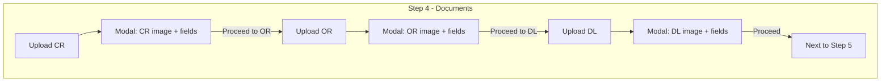

# OCR Extract-Only and Separated Document Upload

## Current behavior

- **Backend**: Extract endpoint tries `validate_document` (image + text comparison) then falls back to `extract_document_data`. Create-application runs `validate_document` on all three docs and returns 422 on failure; OR/CR file-number matching is also enforced via validation.
- **Frontend**: Step 4 shows OR, CR, and DL upload sections side-by-side; user uploads all three, then clicks Next; a single extract call runs for all three; Step 5 shows one confirmation form for OR file no., CR file no., OR expiration, DL expiration.

## Target behavior

1. **OCR**: Used only to extract text and fill fields. No image comparison, no text matching against user/profile data.
2. **Matching**: Document-to-document and document-to-user checks are hardcoded (e.g. compare confirmed OR file number with CR file number on submit; no OCR-based validation).
3. **Step 4**: Documents are **separate** and **sequential**. After each upload, a **modal (or full-width page)** shows:

   - **Left**: Uploaded document image.
   - **Right**: Input fields pre-filled from OCR (e.g. CR: MV file no., expiry date; OR: file no., expiry; DL: expiry, etc.).
   - **Button**: “Proceed to OR” (after CR), “Proceed to Driver’s License” (after OR), “Proceed” (after DL, then allow moving to Step 5).

Order used in the plan: **CR → OR → DL** (you can swap to OR → CR → DL if preferred).

---

## 1. Backend: OCR extract-only and hardcoded matching

### 1.1 Extract endpoint – OCR only

**File:** [GPMS-B/app/api/v1/applicant_route/routes.py](GPMS-B/app/api/v1/applicant_route/routes.py)

- In `extract_document_details` (e.g. around 98–119): **remove** the `validate_document` branch. Call **only** `extract_document_data(temp_path, doc_type)` for each document. No reference image, no `document_type()`, no validation.
- Keep the same response shape: `OR: { file_number, expiration_date }`, `CR: { file_number }`, `DL: { expiration_date }` (and optional dates like `birth_date` for DL if already returned by `extract_dates`).

### 1.2 Single-document extract (for per-document flow)

**File:** [GPMS-B/app/api/v1/applicant_route/routes.py](GPMS-B/app/api/v1/applicant_route/routes.py)

- Add a new endpoint, e.g. `POST /application/extract-one`:
  - Params: `doc_type: str` (OR | CR | DL), `doc_file: UploadFile`.
  - Logic: save file to temp path, call `extract_document_data(temp_path, doc_type)`, map result to the same per-doc shape (file_number, expiration_date where applicable), return JSON, then delete temp file.
- No `validate_document`, no reference images, no profile/validation arrays.

### 1.3 Create application – hardcoded matching only

**File:** [GPMS-B/app/api/v1/applicant_route/routes.py](GPMS-B/app/api/v1/applicant_route/routes.py)

- In `create_application` (around 234–339):
  - **Remove** all `validate_document` usage. Do not run OCR validation when `use_confirmed` is false; require that the frontend always sends confirmed details after the new Step 4 flow (so submission always uses confirmed fields).
  - **Keep** the `use_confirmed` branch: when `confirmed_*` fields are present, accept documents and apply only **hardcoded** checks, e.g.:
    - Normalize and compare `confirmed_or_file_number` and `confirmed_cr_file_number`; if both provided and not equal, return 400 with a clear message (e.g. “OR and CR file numbers do not match”).
    - Optionally: basic format/required checks (non-empty, length, etc.) without OCR.
  - Store the uploaded files as before (for storage/attachments) without running any OCR validation. Remove any 422 validation_errors structure that referred to image_valid/text_valid/date_valid from OCR.

Result: OCR is used only in the extract (and extract-one) endpoints to fill data; create_application does not call OCR and only enforces the hardcoded OR/CR file-number match and required confirmed fields.

---

## 2. Frontend: Step 4 separated uploads and post-upload modal

**File:** [GPMS-A/src/pages/applicant/application/Application.jsx](GPMS-A/src/pages/applicant/application/Application.jsx)

### 2.1 Step 4 state and flow

- **State to add (or refactor):**
  - Document order: e.g. `['CR', 'OR', 'DL']` and `currentDocIndex` (0, 1, 2).
  - Per-document: `uploadedFile`, `extractedData`, and “confirmed” values for the current document (and optionally in a small structure like `docState = { CR: { file, extracted, confirmed }, OR: {...}, DL: {...} }`).
  - Modal: `showDocModal: boolean`, and which doc the modal is for (e.g. `modalDocType: 'CR'|'OR'|'DL'`).
- **Flow:**
  - Step 4 shows **one** upload area at a time: “Upload Certificate of Registration” → then “Upload Official Receipt” → then “Upload Driver’s License.”
  - On file select for the current doc: upload the file to `POST /application/extract-one` with `doc_type` and `doc_file`, get back extracted fields, then set `uploadedFile` and `extractedData` and open the modal for that doc type.

### 2.2 Post-upload modal / page

- **Left:** Rendered image of the uploaded file (e.g. `URL.createObjectURL(uploadedFile)` in an ``).
- **Right:** Form fields for that document type, pre-filled from `extractedData`:
  - **CR:** MV file no. (map from `file_number`), expiry date (from `dates.expiration_date` or equivalent). Add name/address only if you add extraction for them later; otherwise optional manual fields or omit.
  - **OR:** File number, expiration (MM/YYYY).
  - **DL:** Expiration (and birth date if you show it). Name/address if you add extraction later.
- **Button:**
  - After CR: “Proceed to Official Receipt” (close modal, set `currentDocIndex = 1`, clear modal state, show OR upload).
  - After OR: “Proceed to Driver’s License” (same idea, `currentDocIndex = 2`).
  - After DL: “Proceed” (close modal, mark documents step complete; enable “Next” to go to Step 5).
- On “Proceed”, merge the modal’s confirmed values into the parent’s `extractedDocDetails` and `confirmedDocDetails` (so Step 5 and submit already have OR/CR/DL data).

### 2.3 Step 4 “Next” and Step 3 “Next”

- **Step 3 (Vehicle):** “Next” only advances to Step 4 (no document upload or extract yet).
- **Step 4:** “Next” is only enabled when all three documents are done (CR, OR, DL each have a file and have been “Proceed”ed). Clicking “Next” goes to Step 5 (Confirm document details). Do **not** call the batch extract API on “Next”; extraction is done per document when the user uploads each file.
- Remove any logic that requires “all three files present” before any extract; the new flow is one-at-a-time upload → extract-one → modal → proceed.

### 2.4 Remove validation-only UI from Step 4

- Remove or simplify:
  - `validationErrors` and `updateValidationErrors` tied to OCR validation (no more 422 validation_errors from create_application for image/text/expiration).
  - Document “match” warning between OR and CR on Step 4 (matching is enforced on submit via hardcoded check; you can keep a simple client-side “OR and CR file numbers should match” hint on Step 5 if desired).
- Keep a single “Next” button to Step 5 once all three docs are completed in the new flow.

### 2.5 Submit and 422 handling

- If create_application no longer returns 422 for OCR validation, remove or simplify the 422 handler that called `documentFilesRef.updateValidationErrors(validationErrors, ...)` (around 240–267). Keep handling for the hardcoded “OR and CR file numbers do not match” (e.g. 400) and show a toast or inline message.

---

## 3. Optional: Backend field set (name, address)

- Current `extract_document_data` and `extract_dates` / `extract_document_reference` return **file_number** and **dates** (expiration_date, birth_date, etc.). They do **not** currently extract name or address.
- Plan: implement the above with the **existing** fields (MV file no., expiry, OR file no., DL expiry, etc.). If you want “Name” and “Address” on the right side of the modal, that can be:
  - **Option A:** Added later as optional manual fields (no backend change), or  
  - **Option B:** Extended in the backend (e.g. simple regex or line-based heuristics in `document_ocr_utils` or a small helper) and then exposed in the extract-one response and modal fields.

---

## 4. Summary diagram

- **Backend:** Extract and extract-one use only `extract_document_data` (OCR text extraction). Create_application uses only hardcoded rules (OR/CR file number match, required confirmed fields); no `validate_document`.
- **Frontend:** Step 4 = sequential CR → OR → DL upload, each with a post-upload modal (document left, extracted fields right, then “Proceed to OR” / “to DL” / to next step). Step 5 and submit unchanged in spirit; confirmed values come from the new modals.

---

## 5. Files to touch

| Area | File | Changes |

|------|------|--------|

| Backend | [GPMS-B/app/api/v1/applicant_route/routes.py](GPMS-B/app/api/v1/applicant_route/routes.py) | Extract: OCR-only; add extract-one; create_application: remove validate_document, keep hardcoded OR/CR match and use_confirmed. |

| Frontend | [GPMS-A/src/pages/applicant/application/Application.jsx](GPMS-A/src/pages/applicant/application/Application.jsx) | Step 4: one-doc-at-a-time state, upload → extract-one → modal (image + fields), Proceed to OR/DL/next; remove batch extract on Next; simplify validation error UI and 422 handling. |

No change to [GPMS-B/app/utils/document_ocr_utils.py](GPMS-B/app/utils/document_ocr_utils.py) `extract_document_data` signature is required unless you add name/address extraction (optional). [GPMS-B/app/core/ocr_doc_validator.py](GPMS-B/app/core/ocr_doc_validator.py) and related validation helpers can remain for other use but will no longer be called from the applicant application flow.