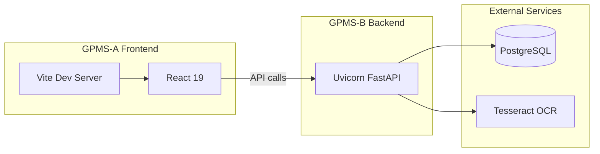

# CSU GPMS - Gate Pass Management System

Vehicle pass authorization system for campus access control. Manages vehicle registration, applications, and document validation (OR, CR, DL) using OCR.

## Architecture



- **GPMS-A**: React 19 + Vite 6 frontend (port 5173)
- **GPMS-B**: FastAPI backend (port 8000)
- **PostgreSQL**: Database
- **Tesseract OCR**: Document validation (OR/CR/DL)

---

## Prerequisites

| Requirement | Version / Details |
|-------------|-------------------|
| **Node.js** | 18+ (LTS recommended) for npm and Vite |
| **Python** | 3.8+ (3.11 recommended for asyncpg) |
| **PostgreSQL** | 12+ (local install or Docker) |
| **Tesseract OCR** | Required for document validation. [Install guide](https://github.com/tesseract-ocr/tesseract) |
| **Git** | Optional, for cloning |

---

## Project Structure

| Path | Description |
|------|-------------|
| `GPMS-A/` | React 19 + Vite 6 frontend |
| `GPMS-B/` | FastAPI backend |
| `GPMS-B/init_gpmsdb.sql` | Optional SQL for manual DB init |
| `DIRECTORY_TREE.md` | Full directory tree reference |

---

## Environment Variables

### GPMS-A (Frontend)

Create `GPMS-A/.env`:

```
VITE_API_BASE_URL=http://127.0.0.1:8000/api/v1
```

### GPMS-B (Backend)

Create `GPMS-B/.env`:

```
DB_HOST=localhost
DB_PORT=5432
DB_NAME=gpmsdb
DB_USER=postgres
DB_PASSWORD=your_password

# Optional - required for email OTP, password reset, staff invite
EMAIL_ADDRESS=your@gmail.com
EMAIL_PASSWORD=app_password
SMTP_SERVER=smtp.gmail.com
SMTP_PORT=587
```

Copy the example files to `.env` and fill in your values:
- `GPMS-A/.env.example` -> `GPMS-A/.env`
- `GPMS-B/.env.example` -> `GPMS-B/.env`

---

## Database Setup

### Option A: Auto-create via FastAPI (default)

1. Create database:
   ```sql
   CREATE DATABASE gpmsdb;
   ```
2. Run the backend (tables are created on startup).
3. Seed data:
   ```bash
   cd GPMS-B
   python -m app.utils.seed_db --action seed
   ```

### Option B: Manual SQL init

1. Create database:
   ```sql
   CREATE DATABASE gpmsdb;
   ```
2. Run the init script:
   ```bash
   psql -U postgres -d gpmsdb -f GPMS-B/init_gpmsdb.sql
   ```
3. Start the backend (will use the existing schema).

---

## Installation & Run

### 1. Backend (GPMS-B)

```bash
cd GPMS-B
python -m venv .venv
```

**Activate virtual environment:**
- Windows: `.venv\Scripts\activate`
- macOS/Linux: `source .venv/bin/activate`

```bash
pip install -r requirements.txt
uvicorn main:app --reload --host 0.0.0.0 --port 8000
```

Seed the database (if using Option A):

```bash
python -m app.utils.seed_db --action seed
```

### 2. Frontend (GPMS-A)

```bash
cd GPMS-A
npm install
npm run dev
```

Open http://localhost:5173

### 3. Tesseract OCR (required for document validation)

**Windows:**
- Download installer from [Tesseract releases](https://github.com/UB-Mannheim/tesseract/wiki)
- Add the install path (e.g. `C:\Program Files\Tesseract-OCR`) to your system PATH
- Or set `pytesseract.pytesseract.tesseract_cmd` in `GPMS-B/app/utils/image_ocr_utils.py` if Tesseract is not in PATH

**macOS:** `brew install tesseract`  
**Linux:** `sudo apt install tesseract-ocr` (Debian/Ubuntu)

---

## Default Login Credentials (from seed)

| Role | Email | Password |
|------|-------|----------|
| Admin | admin@example.com | admin123 |
| Staff | staff@example.com | staff123 |
| Applicant | applicant@example.com | applicant123 |

---

## Verification Checklist

- [ ] Backend: http://127.0.0.1:8000 returns `{"message":"GPMS Server is Running!"}`
- [ ] API docs: http://127.0.0.1:8000/docs
- [ ] Frontend: http://localhost:5173 loads the login page
- [ ] Login works for admin, staff, and applicant roles
- [ ] Applicant can access login via `/applicant-login`, staff via `/staff-login`, admin via `/admin-login`

---

## Troubleshooting

| Issue | Solution |
|-------|----------|
| CORS errors | Ensure backend runs on port 8000 and `VITE_API_BASE_URL` in GPMS-A matches |
| DB connection failed | Check PostgreSQL is running; verify `DB_HOST`, `DB_PORT`, `DB_NAME`, `DB_USER`, `DB_PASSWORD` |
| OCR fails (document validation) | Install Tesseract and add it to PATH |
| Email OTP not sending | Set `EMAIL_ADDRESS`, `EMAIL_PASSWORD`, `SMTP_SERVER`, `SMTP_PORT` (for Gmail, use an [App Password](https://support.google.com/accounts/answer/185833)) |
| Module not found | Activate the virtual environment (backend); run `npm install` (frontend) |
| `asyncpg` / Python version errors | Use Python 3.11+ for better async compatibility |

---

## Production Notes

- Set `SECRET_KEY` from the environment in `GPMS-B/app/core/config.py` (do not commit secrets)
- Use specific CORS origins instead of `allow_origins=["*"]` when using credentials
- Build frontend for production: `cd GPMS-A && npm run build`
- Serve the built files with a web server (e.g. Nginx, Vercel)

---

## Additional Documentation

- [GPMS-B/README.md](GPMS-B/README.md) - Backend-specific details
- [DIRECTORY_TREE.md](DIRECTORY_TREE.md) - Full project structure
